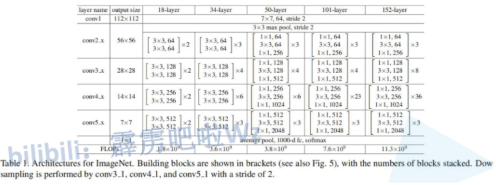

# 序

① SCAAML

> 原文：[Hacker's guide to deep-learning side-channel attacks: code walkthrough](https://elie.net/blog/security/hacker-guide-to-deep-learning-side-channel-attacks-code-walkthrough/)
>
> Github：[https://github.com/google/scaaml](https://github.com/google/scaaml)

### 基础知识：ResNet残差网络

ResNet网络是在2015年由微软实验室提出，斩获当年ImageNet竞赛中分类任务第一名，目标检测第一名。获得COCO数据集中目标检测第一名，图像分割第一名。下图是ResNet34层模型的结构简图：


在ResNet网络中有如下几个**亮点**：

1. 提出residual结构（残差结构），并搭建超深的网络结构(突破1000层)
2. 使用Batch Normalization加速训练(丢弃dropout)

在ResNet网络提出之前，传统的卷积神经网络都是通过将一系列卷积层与下采样层进行堆叠得到的。但是当堆叠到一定网络深度时，就会出现两个问题。1）梯度消失或梯度爆炸。 2）退化问题(degradation problem)。

在ResNet论文中说通过数据的预处理以及在网络中**使用BN（Batch Normalization）层能够解决梯度消失或者梯度爆炸问题**。如果不了解BN层可参考这个[**链接**](https://blog.csdn.net/qq\_37541097/article/details/104434557)。但是对于退化问题（随着网络层数的加深，效果还会变差，如下图所示）并没有很好的解决办法。 

所以ResNet论文提出了**residual结构（残差结构）来减轻退化问题**。下图是使用residual结构的卷积网络，可以看到随着网络的不断加深，效果并没有变差，反而变的更好了。


**论文中的残差结构（residual）**

下图是论文中给出的两种残差结构。左边的残差结构是针对层数较少网络，例如ResNet18层和ResNet34层网络。右边是针对网络层数较多的网络，例如ResNet101，ResNet152等。为什么深层网络要使用右侧的残差结构呢。因为，右侧的残差结构能够减少网络参数与运算量。同样输入、输出一个channel为256的特征矩阵，如果使用左侧的残差结构需要大约1170648个参数，但如果使用右侧的残差结构只需要69632个参数。明显搭建深层网络时，使用右侧的残差结构更合适。

> 这里左侧的图原文中是64-d，为了方便对比两种残差结构的参数量，将输入的维度改为和右侧一致的256-d


先对左侧的残差结构（针对ResNet18/34）进行一个分析。如下图所示，该残差结构的主分支是由两层3x3的卷积层组成，而残差结构右侧的连接线是shortcut分支也称捷径分支（注意为了让主分支上的输出矩阵能够与我们捷径分支上的输出矩阵进行相加，必须保证这两个输出特征矩阵有相同的shape）。

**右侧的虚线分支：输入shape和输出shape不同，因此虚线部分有一个filter**

> 分支1： padding=1，将input size的长宽降为1/2，深度增加
>
> 分支2： padding=0


**为什么这个分支结构是虚线？**

如下图（上）所示，对于resnet-34层结构来说，max pooling层之后的输出是56x56x64，而conv2\_x期望的输入就是56x56x64，所以如下图（下）所示，conv2\_x的第一个块的分支是实线结构。对于conv\_3x来说，上一层的输出是56x56x64，它期望的输入是56x56x128，因此分支的shortcut为虚线（有一个filter），来改变输入特征矩阵的shape，使得输入的shape和主分支的输出shape相同，这样才能进行相加。

简单来说就是虚线分支是用来改变输入特征矩阵的shape，使其与主分支的特征矩阵相同，从而进行相加


***

### SCAAML

用自动调参方法

SCAAML models are hard to find by hand so instead it is best to use **hyper-tuning** to find the right model automatically

Kubernetes & Keras Tuner

待看：

_Collecting power traces_ 之后的部分

[https://elie.net/blog/security/hacker-guide-to-deep-learning-side-channel-attacks-the-theory/#toc-9](https://elie.net/blog/security/hacker-guide-to-deep-learning-side-channel-attacks-the-theory/#toc-9)

基于深度学习的侧信道攻击泄漏调试器，目的是帮助芯片设计者快速找到泄漏源并修复它：

[SCALD, our deep-learning-based side-channel attacks leakage debugger](https://elie.net/talk/a-hacker-guide-to-side-channel-attack-surface-reduction-using-deep-learning/)

#### 文件结构


*   scaaml/

    包含SCAAML python库，围绕将DL应用于SCA的所有研究中都使用这个库
*   scaaml/intro/model.py

    在本教程中深入讨论的关键文件：模型架构。它包含了我们要用来攻击TinyAES的TensorFlow Keras模型架构。

    使用**Keras Functional API**。对于那些不熟悉它的人来说，Keras功能API允许你**定义具有非线性拓扑结构的模型，如果你想做共享层、多输入和多输出，这是必不可少的**。如果你对深度学习和TensorFlow很认真，那么学习如何使用这个API而不是Sequential的API是必须的。
*   scaaml\_intro/

    这个目录包含本教程的代码。正如README中所讨论的，在这个目录中有两个主要的脚本：

    * train.py用来训练模型
    * key\_recovery\_demo.ipynb，用训练好的模型进行攻击。如前所述，你可以跳过运行train.py，因为我们提供了训练好的模型。
*   /tests/scald/test\_generator.py

    数据集单元测试，验证数据集的正确性

#### 训练模型

***

**配置文件`config/stm32f415_tinyaes.json`**

```
 {     "model": "cnn",     "device": "stm32f415",     "algorithm": "tinyaes",     "version": "10",        //攻击点有3个，AES-128的密钥有16byte，所以一共有3x16=48个模型要训练     "attack_points": [         "sub_bytes_out",         "sub_bytes_in",         "key"     ],     "attack_bytes": [         "0",         "1",         "2",         "3",         "4",         "5",         "6",         "7",         "8",         "9",         "10",         "11",         "12",         "13",         "14",         "15"     ],     "max_trace_len": 20000,     //num_shards & num_traces_per_shard 定义了加载多少数据     "num_shards": 256,  //1个shard包含一个给定key的所有example，所以shard的数量等于使用的key的数量     "num_traces_per_shard": 256,  //对于一个给定的key要使用的不同的能量迹/明文样本数     "batch_size": 32,     "epochs": 30,     "optimizer_parameters": {         "lr": 0.001,         "multi_gpu_lr": 0.001     },     "model_parameters": {         "activation": "relu",         "initial_filters": 8,         "initial_pool_size": 4,         "block_kernel_size": 3,         "blocks_stack1": 3,         "blocks_stack2": 4,         "blocks_stack3": 4,         "blocks_stack4": 3,         "dense_dropout": 0.1     } }
```

**模型架构**

**一般结构**

基于ResNet结构的预激活版本（aka V2），将激活放在卷积之前，效果比其他resnet变体更好

```
     inputs = layers.Input(shape=(input_shape))     x = inputs ​     # stem     x = layers.MaxPool1D(pool_size=pool_size)(x) ​     # trunk: stack of residual block     for block_idx in range(4):         filters *= 2         x = stack(x,                   filters,                   num_blocks[block_idx],                   kernel_size=block_kernel_size,                   activation=activation) ​     # head model: dense     x = layers.GlobalAveragePooling1D()(x)     for _ in range(1):         x = layers.Dropout(dense_dropout)(x)         x = layers.Dense(256)(x)         x = layers.BatchNormalization()(x)         x = layers.Activation(activation)(x) ​     outputs = layers.Dense(256, activation='softmax')(x)
```

**stack结构**

```
 def stack(x, filters, blocks, kernel_size=3, strides=2, activation='relu'):     """A set of stacked residual blocks.     Args:         filters (int): filters of the bottleneck layer. ​         blocks (int): number of conv blocks to stack. ​         kernel_size(int, optional): kernel size of the bottleneck layer.         defaults to 3. ​         strides (int, optional): stride used in the last block.         defaults to 2. ​         conv_shortcut (bool, optional): Use convolution shortcut if True,         otherwise identity shortcut. Defaults to False. ​         activation (str, optional): activation function. Defaults to 'relu'. ​     Returns:         tensor:Output tensor for the stacked blocks.   """ ​     # 每个stack包含几个block     # 第一个block     x = block(x,               filters,               kernel_size=kernel_size,               activation=activation,               conv_shortcut=True) ​     # 中间的block     for i in range(2, blocks):         x = block(x, filters, kernel_size=kernel_size, activation=activation) ​     # 最后一个block     x = block(x, filters, strides=strides, activation=activation)     return x ​
```

**residual block结构**

这里用的是预激活残差块，也就是说**先进行BN，然后激活，再进行卷积**。

```
 def block(x,           filters,           kernel_size=3,           strides=1,           conv_shortcut=False,           activation='relu'):     """Residual block with preactivation     From: https://arxiv.org/pdf/1603.05027.pdf ​     Args:         x: input tensor.         filters (int): filters of the bottleneck layer. ​         kernel_size(int, optional): kernel size of the bottleneck layer.         defaults to 3. ​         strides (int, optional): stride of the first layer.         defaults to 1. ​         conv_shortcut (bool, optional): Use convolution shortcut if True,         otherwise identity shortcut. Defaults to False. ​         use_batchnorm (bool, optional): Use batchnormalization if True.         Defaults to True. ​         activation (str, optional): activation function. Defaults to 'relu'. ​     Returns:         Output tensor for the residual block.     """ ​     x = layers.BatchNormalization()(x)     x = layers.Activation(activation)(x) ​     if conv_shortcut:         shortcut = layers.Conv1D(4 * filters, 1, strides=strides)(x)     else:         if strides > 1:             shortcut = layers.MaxPooling1D(1, strides=strides)(x)         else:             shortcut = x ​     x = layers.Conv1D(filters, 1, use_bias=False, padding='same')(x)     x = layers.BatchNormalization()(x)     x = layers.Activation(activation)(x) ​     x = layers.Conv1D(filters,                       kernel_size,                       strides=strides,                       use_bias=False,                       padding='same')(x)     x = layers.BatchNormalization()(x)     x = layers.Activation(activation)(x) ​     x = layers.Conv1D(4 * filters, 1)(x)     x = layers.Add()([shortcut, x])     return x
```

#### 恢复测试密钥

***

jupyter-notebook：[https://github.com/google/scaaml/blob/master/scaaml\_intro/key\_recovery\_demo.ipynb](https://github.com/google/scaaml/blob/master/scaaml\_intro/key\_recovery\_demo.ipynb)

攻击点有3个，因此对于AES-128来说，密钥为16 bytes，因此一共有 _**3 个攻击点 x 16 字节 = 48 个模型。**_

## 显卡配置

### 服务器设置

**Dell R720** 在用户手册和产品定位中是不支持独立显卡的，但在技术上是没有问题的。由于 Dell 对 R720 显卡方面的限制，所以在加入独立显卡后可能会出现一些特别的小问题，需要注意。在 Dell 社区和技术手册中，给出了 R720 如果安装独立显卡需要满足的条件：

> Requires 2 CPUs CPU must be 95W or less Max of two double wide GPGPU (rule that they take up 2 slots) Max of four single wide GPGPU All GPUs must be same type / model GPU requires redundant 1100W PSU and GPU enablement kit Two double-wide GPU requires optional riser 3 Four single wide GPU cannot have optional riser 3 TBU not supported

* 对电源（两个 1100W 供电支持）和功率（小于 95W）的限制其实可以无视，这是对服务器高稳定性要求下的结果。在单 750W PSU 的支持下跑一个 GTX 1060 6G 是完全没有问题的（一般时负载也就大约 200W）
* 显卡尺寸是机架式服务器主要需要考虑的问题。R720 支持两个双卡位 GPU（RISER2, RISER3）
* 如果不想考虑显卡尺寸的问题的话，购买公版卡（Founders' Edition）或者涡轮版（比如华硕的 Turbo 卡），一些设计比较保守的非公版也是可以的（查参数时发现索泰 G1 Gaming 卡的尺寸应该是没有问题的）
* 装入显卡后必须在 BIOS 中禁用集成显卡，否则主板不会读取独立显卡的信息。关闭集成显卡后，服务器后面板的 VGA 不再支持画面输出，iDRAC 中的 IPMI VNC 远程连接也会无效。
*   集成显卡关闭方法为：

    1. 开机时使用 F2 键进入 System Setup
    2. 进入 Bios 设置
    3. 选择内部设备管理（Integrated Devices）
    4.  _将集成显卡禁用 (Disable Embedded Video Controller)_

        > 这一步不禁用也可以
    5. 重启设备

    

### 安装显卡驱动

从NVIDIA官网下载相应驱动 [https://www.nvidia.com/Download/index.aspx?lang=en-us](https://www.nvidia.com/Download/index.aspx?lang=en-us)


看一下ubuntu架构（32bit还是64bit）

1.  删除原有的NVIDIA驱动程序

    ```
     sudo apt-get remove –purge nvidia*
    ```
2. 进入电脑的BIOS，把Security Boot设置为Disabled 如果没有禁用secure boot，可能会导致Nvidia驱动安装不正常。BIOS在开机之前的界面（一般长按F12）进入。
3.  禁用nouveau 默认情况下，Ubuntu采用开源的nouveau驱动程序作为Nvidia显卡的驱动，需要将其禁用 打开编辑配置文件：

    ```
     sudo vim /etc/modprobe.d/blacklist.conf
    ```

    在最后一行添加：

    ```
     blacklist nouveau
    ```

    这一条是用来禁用nouveau驱动，之后也不需要改回来。 由于nouveau是构建在内核中的，所以要执行下面命令生效:

    ```
     sudo update-initramfs -u
    ```
4.  重启

    ```
     reboot
    ```

    重启之后，可以看nouveau有没有运行:

    ```
     lsmod | grep nouveau  
    ```

    没有任何输出代表禁用生效了。
5.  给驱动文件增加可执行权限：

    ```
     sudo chmod a+x NVIDIA-Linux-x86_64-460.32.03.run
    ```

    安装：

    ```
     sudo sh ./NVIDIA-Linux-x86_64-460.32.03.run –no-x-check –no-nouveau-check –no-opengl-files
    ```

    安装完成后重启，使用`nvidia-smi`验证是否安装成功。

    

### 安装CUDA

从上面的图中可以看到rtx3090最高可以支持cuda11.5

下载cuda [https://developer.nvidia.com/cuda-toolkit-archive](https://developer.nvidia.com/cuda-toolkit-archive) 首先需要知道不同版本的cuda需要的gcc版本是不同的，cuda11.0与gcc的对应关系如下：


找到自己需要的cuda版本如下选择，最下面框内会给出下载和命令：

**tensorflow官网目前最高支持cuda11.2，官方给出的示例是11.0，这里也下载11.0**


下图在Driver处敲回车，选择不安装驱动，因为之前已经安装过驱动程序，这里是因为每个cuda都会自带一套符合当前版本cuda最低要求的驱动程序，如果这里选择安装的驱动的话，在Windows上安装时会将之前安装的驱动覆盖，但是在linux上覆盖安装的话，可能会出现错误，具体没有试过。这里使用之前自己下载的驱动：


如果显示如上图，则表示安装完成，但还不算安装成功，根据提示需要配置环境变量，进行如下操作：

```
 # 打开.bashrc文件 gedit ~/.bashrc
```

在文件末尾输入如下内容并保存退出。

```
 # 将下面的11.0替换为你的cuda版本，其他不变，如果不知道自己安装的是哪个版本，就去/usr/local/文件夹下找一下 export PATH=/usr/local/cuda-11.0/bin${PATH:+:${PATH}} export LD_LIBRARY_PATH=/usr/local/cuda-11.0/lib64${LD_LIBRARY_PATH:+:${LD_LIBRARY_PATH}}
```

完事儿以后，执行如下命令更新变量，使其生效

```
 source ~/.bashrc
```

在终端输入

```
 nvcc -V
```

显示CUDA的信息，表明安装完成。

### 安装cuDNN

下载cudnn [https://developer.nvidia.com/rdp/cudnn-download](https://developer.nvidia.com/rdp/cudnn-download)

**cuDNN的版本选择很重要，因为CUDA装的是11.0，所以第一次安装时随便选了一个适合CUDA11.0的版本：**[**cuDNN v8.0.5 (November 9th, 2020), for CUDA 11.0**](https://developer.nvidia.com/rdp/cudnn-archive#a-collapse805-110)**，然后后面测试代码的时候就出现了问题，是因为CUDA11.0编译的cuDNN版本是8.1.0，但是load的是8.0.5（因为装的是8.0.5），后来卸载了8.0.5的版本，重装了**[**cuDNN v8.1.0 (January 26th, 2021), for CUDA 11.0,11.1 and 11.2**](https://developer.nvidia.com/rdp/cudnn-archive#a-collapse810-111)**版本，解决问题。**

此外，这里还有一个**很坑的地方**，网上的大多错误的安装cuDNN的方式都是将下载后的cuDNN压缩包解压。然后再将cudnn的头文件（cuda/include目录下的.h文件）复制到cuda安装路径的include路径下，将cudnn的库文件（cuda/lib64目录下的所有文件）复制到cuda安装路径的lib64路径下。这种方法如果不重置cuDNN相应的符号链接的话是不能成功的安装cuDNN的。

**正确的安装cuDNN方式**

1. 解压当前的.tgz格式的软件包到系统中的任意路径（这个路径很重要），解压后的文件夹名为cuda，文件夹中包含两个文件夹：一个为include，另一个为lib64。 例如：我将这个压缩包解压在了/usr/local目录下，那么该文件的绝对路径为/usr/local/cuda

```
 tar -zvxf archive_name.tar.gz -C /usr/local
```

1. 将解压后的文件中的lib64文件夹关联到环境变量中。这一步很重要。

```
 sudo vim ~/.bashrc
```

在最后一行加入：

```
 export LD_LIBRARY_PATH=/usr/local/cuda/lib64:$LD_LIBRARY_PATH
```

然后

```
 source ~/.bashrc
```

1. 再重启一下Terminal（终端），该步骤可以成功的配置cuDNN的Lib文件。
2. 重置cudnn.h文件的读写权限：

```
 sudo chmod a+r /usr/local/cuda/include/cudnn.h
```

### 测试

随便跑一个代码试一下GPU能不能使用：


比之前CPU跑的速度快很多，配置成功。

## ② TCHES2021- Reinforcement Learning for Hyperparameter Tuning in Deep Learning-based Side-channel Analysis的[开源代码](https://github.com/AISyLab/Reinforcement-Learning-for-SCA)

环境：python3.6 + tensorflow2.1 + cuda10.x + cudnn 10.1-7.6.0.64

```
 cloudpickle==1.2.2 countermeasures-cython==0.0.1 graphviz==0.13.2 imbalanced-learn==0.6.1 matplotlib==3.1.2 pandas==0.25.3 pillow==7.0.0 pip-chill==0.1.8 psutil==5.6.7 pydot==1.4.1 pyyaml==5.3 tensorflow==2.1.0 tqdm==4.42.1 visidata==1.5.2 yapps==2.2.0
```

## 4. 模型训练测试

**ascadv2-multi-resnet-earlystopping.h5**

ASCAD提供的：


\*自己训练的：


**ascadv2-multi-resnet-earlystopping.h5**

ASCAD提供：


#### MLP

**mlp\_best\_ascad\_desync0\_node200\_layernb6\_epochs200\_classes256\_batchsize100.h5**


**\*my\_mlp\_desync0\_epochs200\_batchsize100.h5**


**\*my\_mlp\_desync0\_epochs400\_batchsize500.h5**


**mlp\_best\_ascad\_desync50\_node200\_layernb6\_epochs200\_classes256\_batchsize100.h5**


**\*my\_mlp\_desync50\_epochs400\_batchsize500.h5**


**mlp\_best\_ascad\_desync100\_node200\_layernb6\_epochs200\_classes256\_batchsize100.h5**


**\*my\_mlp\_desync100\_epochs400\_batchsize500.h5**


## 5. 模型训练（等采集能量迹）

*   怎么训练模型

    目标：使模型具有恢复所有消息比特的能力

    * 一般的模型是通过带标签的能量迹训练神经网络，再将攻击能量迹输入到训练好的模型中，从而输出得到猜测密钥（或中间值）
    * NDGJ21需要用一组带标签的能量迹训练神经网络，
* Saber能量迹的采集，格式h5文件，应该还要对齐，以及其他的一些输入数据的预处理
*   调参，测试

    | 网络参数       |                                |
    | ---------- | ------------------------------ |
    | 损失函数       | 交叉熵                            |
    | 优化器        | Nadam（RMSprop的扩展，带有Nesterov动量） |
    | 学习率        | 0.001（数值稳定性常数epsilon=1e-08）    |
    | epoch      | 最多300个                         |
    | batch size | 32                             |
    | early stop | 1                              |
    | 训练集 : 验证集  | 7 : 3                          |

    > NDGJ21中提到模型调参方法是用**网格搜索法**

## 服务器

R8424 G11：**￥22,798.00起**

[http://www.chinasupercloud.com/serverdetails.html?id=2996](http://www.chinasupercloud.com/serverdetails.html?id=2996)

\

